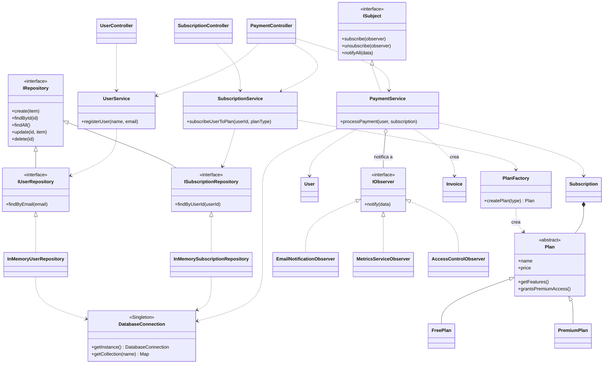

# Diagrama de clases UML — Sistema de Gestión de Suscripciones y Facturación Premium

Este diagrama muestra cómo interactúan los 5 patrones de diseño implementados:

- **Singleton**: `DatabaseConnection`
- **Factory Method**: `PlanFactory`
- **Repository**: `IRepository`, `IUserRepository`, `ISubscriptionRepository` + sus implementaciones en memoria
- **Observer**: `ISubject`, `IObserver` + `PaymentService` (Subject) y sus 3 Observers concretos
- **MVC**: `Controllers` → `Services` → `Repositories`/`Models`

> GitHub renderiza automáticamente el bloque `mermaid` de abajo al ver este archivo en el repositorio — no hace falta exportar una imagen aparte.

